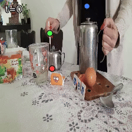
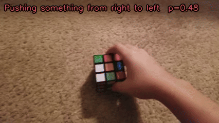

# Towards Data-Efficient Video Pre-training with Frozen Image Foundation Models

Svetlana Orlova, Niccolò Cavagnero, Gijs Dubbelman \ Eindhoven University of Technology.

<!-- commented out:
[](https://arxiv.org/abs/2507.09338)
-->

[](https://huggingface.co/tue-mps/towards-video-image-frozen)  


<!-- NuScenes and PT -->
<p align="center">
  <a href="https://youtu.be/a1VBQi2zMxY?si=8uysS0m-lsvTzVEM" target="_blank">
    
  </a>
  <a href="https://youtu.be/CtgPfG3AXsg?si=0zZWC29fKZe2zPjE" target="_blank">
    
  </a>
</p>

<!-- ScanNet and Waymo TBD -->
<p align="center">
  <a href="https://youtu.be/RJVDMZYabjw?si=Ayc0ZEK5r_0QkKus" target="_blank">
    
  </a>
  <a href="https://youtu.be/CtgPfG3AXsg?si=0zZWC29fKZe2zPjE" target="_blank">
    
  </a>
</p>

<!-- SthSthV2 -->
<p align="center">
  <a href="https://youtu.be/OBby24DEkJA?si=lO_YrjrEii7UZNAT" target="_blank">
    
  </a>
</p>

Video foundation models achieve strong performance across many video understanding tasks, but typically require large-scale pre-training on massive video datasets, resulting in substantial data and compute costs. In contrast, modern image foundation models already provide powerful spatial representations. This raises an important question: can competitive video models be built by reusing these spatial representations and pre-training only for temporal reasoning? We take initial steps toward exploring a lightweight training paradigm that freezes a pre-trained image foundation model and trains only a recurrent temporal module to process streaming video. By reusing an image foundation model as a spatial encoder, this approach could significantly reduce the amount of video data and compute required compared to end-to-end video pre-training. In this work, we explore the feasibility of this approach before investing in computing for video pre-training. Our empirical findings across multiple video understanding tasks suggest that strong temporal performance can emerge without large-scale video pre-training, motivating future work on recurrent video foundation models obtained by pre-training a temporal module on top of a frozen image foundation model.

## 🔥 PyTorch RVM

Beyond the contributions of the paper, this repository ships a pure PyTorch
implementation of Recurrent Video Masked Autoencoders (RVM, Zoran et al., 2025)
— encoder, GRU-gated recurrent core, and readouts — with no JAX/Flax
dependency whatsoever. Original JAX RVM checkpoints have to be converted, see [Backbone weights](#backbone-weights).

## 🔨 Preparations

### Installation

Tested with Python 3.x + CUDA 12.6 (16.12.2025). Adjust the CUDA wheel index
to match your driver if needed.

```bash
conda create -n myenv python
conda activate myenv

# Most recent PyTorch should work fine:
pip3 install torch torchvision 

pip install --no-build-isolation timm torchmetrics pytorch-lightning pandas tensorboard tensorboardX psutil
pip install --no-build-isolation natsort tqdm einops decord scipy scikit-learn
pip install --no-build-isolation opencv-python
pip install --no-build-isolation mamba-ssm
```

`--no-build-isolation` avoids a NumPy ABI conflict we observed when pip rebuilds
some wheels from source. If a fresh install pulls in a NumPy version that
breaks OpenCV, reinstall `opencv-python` with `--no-build-isolation`.

### Backbone weights

Both architecture families in this repo use a **frozen image encoder**.
Download or convert the weights once and reuse them across tasks.

**DINOv3.** Download the official DINOv3 ViT (Small / Base / Large) weights
from [facebookresearch/dinov3](https://github.com/facebookresearch/dinov3),
following the instructions in that repo. Pass the resulting `.pth` to the
inference scripts via `--backbone-weights /path/to/dinov3_vit*.pth`. Make sure
the backbone size constants at the top of the inference script match the
checkpoint you downloaded.

**RVM.** The official RVM checkpoints are released as JAX `.npz` files at
[google-deepmind/representations4d](https://github.com/google-deepmind/representations4d)
(see [`colabs/rvm_inference_demo.ipynb`](https://github.com/google-deepmind/representations4d/blob/main/colabs/rvm_inference_demo.ipynb)
for the download links). They cannot be loaded into this codebase as-is —
first convert the `.npz` to a PyTorch state dict with the converter in
[`scripts_support/`](scripts_support/):

```bash
# Edit MODEL_SIZE ("large" or "base") and CHECKPOINT_PATH at the top of
# the file to point at the downloaded .npz, then run:
python scripts_support/load_rvm_ckpt.py
```

The converter supports the **Base** and **Large** RVM variants (Small is not
included in the official release). It writes a `*_pytorch_wrapper.pth` next to
the input `.npz`, with Q/K/V fused for `nn.MultiheadAttention` — the layout
expected by the inference scripts and by the wrappers in
[`models/rvm_modules/`](models/rvm_modules/). Pass that `*_pytorch_wrapper.pth`
as `--backbone-weights` when running with `--arch rvm`.

**Verifying the conversion.** The script
[`models/rvm_modules/_verify_rvm_implementation.py`](models/rvm_modules/_verify_rvm_implementation.py)
runs the wrapped/training model and a straightforward PyTorch transcription
of the RVM colab on identical inputs (both seeded from the same `.npz` via the
same converter), and confirms they agree up to normal numerical precision
(encoder ≈ 1e-4, core ≈ 1e-3 in float32, ≈ 1e-1 under float16 autocast).

## 📍 Models

For every task we ship three checkpoints, all using the streaming protocol:

1. **RVM** — original RVM (frozen ViT + frozen GatedTransformerCore); only the readout is tuned.
2. **DINOv3 + RVM_RNN** — frozen DINOv3 image encoder + GatedTransformerCore + readout, both trained from scratch.
3. **DINOv3 + GMMix** — frozen DINOv3 image encoder + GatedMambaMix temporal core + readout, both trained from scratch.

`frozen` / `fine-tuned` columns list which parts of the model are kept frozen vs. trained.

### Something-Something v2 — action recognition

| Model              | Acc %  | ckpt | `--arch`                | frozen              | fine-tuned          |
| ------------------ | ------ | ---- | ----------------------- | ------------------- | ------------------- |
| RVM                | 46.9    | [`ckpts/SthSthV2/RVM_readout.ckpt`](https://huggingface.co/tue-mps/towards-video-image-frozen/resolve/main/ckpts/SthSthV2/RVM_readout.ckpt) | `rvm`                   | Encoder, RNN module | Readout             |
| DINOv3 + RVM_RNN   | 67.1    | [`ckpts/SthSthV2/DINOv3+Gated.ckpt`](https://huggingface.co/tue-mps/towards-video-image-frozen/resolve/main/ckpts/SthSthV2/DINOv3+Gated.ckpt) | `dinov3_rvmrnn`         | Encoder             | RNN module, Readout |
| DINOv3 + GMMix     | 66.9    | [`ckpts/SthSthV2/DINOv3+GMM.ckpt`](https://huggingface.co/tue-mps/towards-video-image-frozen/resolve/main/ckpts/SthSthV2/DINOv3+GMM.ckpt) | `dinov3_gatedmambamix`  | Encoder             | RNN module, Readout |

### Waymo Open — object tracking

| Model              | mIoU   | ckpt | `--arch`                | frozen              | fine-tuned          |
| ------------------ | ------ | ---- | ----------------------- | ------------------- | ------------------- |
| RVM                | 72.7    | TBD  | `rvm`                   | Encoder, RNN module | Readout             |
| DINOv3 + RVM_RNN   | 85.7   | TBD  | `dinov3_rvmrnn`         | Encoder             | RNN module, Readout |
| DINOv3 + GMMix     | 85.0    | TBD  | `dinov3_gatedmambamix`  | Encoder             | RNN module, Readout |

### Perception Test — point tracking

| Model              | AJ     | ckpt | `--arch`                | frozen              | fine-tuned          |
| ------------------ | ------ | ---- | ----------------------- | ------------------- | ------------------- |
| RVM                | 61.3    | [`ckpts/PerceptionTest/RVM_readout.ckpt`](https://huggingface.co/tue-mps/towards-video-image-frozen/resolve/main/ckpts/PerceptionTest/RVM_readout.ckpt) | `rvm`                   | Encoder, RNN module | Readout             |
| DINOv3 + RVM_RNN   | 63.7    | [`ckpts/PerceptionTest/DINOv3+Gated.ckpt`](https://huggingface.co/tue-mps/towards-video-image-frozen/resolve/main/ckpts/PerceptionTest/DINOv3+Gated.ckpt) | `dinov3_rvmrnn`         | Encoder             | RNN module, Readout |
| DINOv3 + GMMix     | 69.4    | [`ckpts/PerceptionTest/DINOv3+GMM.ckpt`](https://huggingface.co/tue-mps/towards-video-image-frozen/resolve/main/ckpts/PerceptionTest/DINOv3+GMM.ckpt) | `dinov3_gatedmambamix`  | Encoder             | RNN module, Readout |

### ScanNet — depth estimation

| Model              | AbsRel ↓ | ckpt | `--arch`                | frozen              | fine-tuned          |
| ------------------ | -------- | ---- | ----------------------- | ------------------- | ------------------- |
| RVM                | 0.1293      | [`ckpts/ScanNet/RVM_readout.ckpt`](https://huggingface.co/tue-mps/towards-video-image-frozen/resolve/main/ckpts/ScanNet/RVM_readout.ckpt) | `rvm`                   | Encoder, RNN module | Readout             |
| DINOv3 + RVM_RNN   | 0.0900      | [`ckpts/ScanNet/DINOv3+Gated.ckpt`](https://huggingface.co/tue-mps/towards-video-image-frozen/resolve/main/ckpts/ScanNet/DINOv3+Gated.ckpt) | `dinov3_rvmrnn`         | Encoder             | RNN module, Readout |
| DINOv3 + GMMix     | 0.0885      | [`ckpts/ScanNet/DINOv3+GMM.ckpt`](https://huggingface.co/tue-mps/towards-video-image-frozen/resolve/main/ckpts/ScanNet/DINOv3+GMM.ckpt) | `dinov3_gatedmambamix`  | Encoder             | RNN module, Readout |

### NuScenes — camera pose estimation

| Model              | RPEₜᵣ (mm) ↓ | ckpt | `--arch`                | frozen              | fine-tuned          |
| ------------------ | ------------ | ---- | ----------------------- | ------------------- | ------------------- |
| RVM                | 36.00          | [`ckpts/NuScenes/RVM_readout.ckpt`](https://huggingface.co/tue-mps/towards-video-image-frozen/resolve/main/ckpts/NuScenes/RVM_readout.ckpt) | `rvm`                   | Encoder, RNN module | Readout             |
| DINOv3 + RVM_RNN   | 29.37          | [`ckpts/NuScenes/DINOv3+Gated.ckpt`](https://huggingface.co/tue-mps/towards-video-image-frozen/resolve/main/ckpts/NuScenes/DINOv3+Gated.ckpt) | `dinov3_rvmrnn`         | Encoder             | RNN module, Readout |
| DINOv3 + GMMix     | 28.09          | [`ckpts/NuScenes/DINOv3+GMM.ckpt`](https://huggingface.co/tue-mps/towards-video-image-frozen/resolve/main/ckpts/NuScenes/DINOv3+GMM.ckpt) | `dinov3_gatedmambamix`  | Encoder             | RNN module, Readout |

## 🚀 Run

A short example video for each task is available on the [Hugging Face repo](https://huggingface.co/tue-mps/towards-video-image-frozen/tree/main/video_examples) — handy if you just want to try the inference scripts without preparing your own data.

Inference scripts live under `scripts_inference/`, one per task. They share
the same CLI:

```
python scripts_inference/inference_<task>.py \
    --video <path>             # video file (anything decord can decode)
    --arch  <arch>             # one of: rvm, dinov3_mamba, dinov3_mambamix, dinov3_gatedmambamix
    --backbone-weights <path>  # DINOv3 .pth (for dinov3_*) OR converted RVM *_pytorch_wrapper.pth (for arch=rvm)
    --tuned-ckpt <path>        # the per-task Lightning .ckpt that holds the trained temporal core + readout
    --visualize                # (optional) save an annotated mp4 next to the input video
```

Object tracking (Waymo) and point tracking (Perception Test) additionally take
`--query <init.json>` (initial bbox or query points). Depth (ScanNet) accepts
`--out-depth <path.npy>` to dump per-frame depth maps. Action recognition (SSv2)
accepts `--class-names <labels.txt>` to print human-readable class names.

The backbone size (`small` / `base` / `large`) and all other architectural
knobs are hardcoded in each script as top-level constants; edit them in-file
to switch sizes.

### Example: DINOv3-L + GatedMambaMix on NuScenes pose (streaming)

```bash
python scripts_inference/inference_nuscenes.py \
    --video video_examples/nuscenes/scene-0268.mp4 \
    --arch dinov3_gatedmambamix \
    --backbone-weights /path/to/dinov3_vitl16.pth \
    --tuned-ckpt /path/to/nuscenes_gmmix.ckpt \
    --visualize
```

### Example: RVM-L (frozen baseline) on Perception Test point tracking (streaming)

```bash
python scripts_inference/inference_pt.py \
    --video video_examples/perception_test/video_6860_000000.mp4 \
    --query video_examples/perception_test/video_6860_000000.query.json \
    --arch rvm \
    --backbone-weights /path/to/pretrain_rvm_large16_256_pytorch_wrapper.pth \
    --tuned-ckpt /path/to/pt_readout_rvm.ckpt
```

### Example: DINOv3-L + GMMix on ScanNet depth (streaming), save depth maps

```bash
python scripts_inference/inference_scannet.py \
    --video video_examples/scannet/scene0011_00.mp4 \
    --arch dinov3_gatedmambamix \
    --backbone-weights /path/to/dinov3_vitl16.pth \
    --tuned-ckpt /path/to/scannet_gmmix.ckpt \
    --out-depth /tmp/scannet_pred_depth.npy
```

## 🔒 License and attribution

This repository is released under the **MIT License** (see [LICENSE](LICENSE)) — *except* for the vendored DINOv3 source tree under [`models/image_encoder/dinov3/`](models/image_encoder/dinov3/), which is copied from [facebookresearch/dinov3](https://github.com/facebookresearch/dinov3) and remains under the original **DINOv3 License** (see [`models/image_encoder/dinov3/LICENSE.md`](models/image_encoder/dinov3/LICENSE.md)). The DINOv3 License permits commercial use and redistribution but imposes use restrictions (e.g. no military, weapons, or ITAR-controlled applications) and requires that any further redistribution of those files include a copy of the DINOv3 License. The same license also governs any DINOv3 pre-trained weights you download from Meta and use with this code.

Parts of this code are adapted from [google-deepmind/representations4d](https://github.com/google-deepmind/representations4d) (Apache-2.0) — many thanks to the DeepMind authors for releasing their reference implementation.

## ✏️ Citation

If you find this work useful, please cite our paper:

```bibtex
@inproceedings{orlova2026frozen,
  title     = {Towards Data-Efficient Video Pre-training with Frozen Image Foundation Models},
  author    = {Orlova, Svetlana and Cavagnero, Niccol\`o and Dubbelman, Gijs},
  booktitle = {Proceedings of the IEEE/CVF Conference on Computer Vision and Pattern Recognition (CVPR) Workshops},
  year      = {2026},
}
```

Please also cite the works we build on:

```bibtex
@misc{simeoni2025dinov3,
  title={{DINOv3}},
  author={Sim{\'e}oni, Oriane and Vo, Huy V. and Seitzer, Maximilian and Baldassarre, Federico and Oquab, Maxime and Jose, Cijo and Khalidov, Vasil and Szafraniec, Marc and Yi, Seungeun and Ramamonjisoa, Micha{\"e}l and Massa, Francisco and Haziza, Daniel and Wehrstedt, Luca and Wang, Jianyuan and Darcet, Timoth{\'e}e and Moutakanni, Th{\'e}o and Sentana, Leonel and Roberts, Claire and Vedaldi, Andrea and Tolan, Jamie and Brandt, John and Couprie, Camille and Mairal, Julien and J{\'e}gou, Herv{\'e} and Labatut, Patrick and Bojanowski, Piotr},
  year={2025},
  eprint={2508.10104},
  archivePrefix={arXiv},
  primaryClass={cs.CV},
  url={https://arxiv.org/abs/2508.10104},
}

@article{zoran2025recurrent,
  title={Recurrent Video Masked Autoencoders},
  author={Zoran, Daniel and Parthasarathy, Nikhil and Yang, Yi and Hudson, Drew A and Carreira, Joao and Zisserman, Andrew},
  journal={arXiv preprint arXiv:2512.13684},
  year={2025}
}
```
